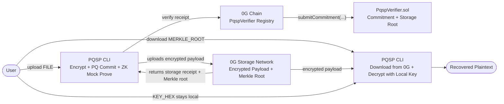

# Post-Quantum Sovereign Privacy Storage

[](https://www.rust-lang.org/)
[](https://soliditylang.org/)
[](https://0g.ai/)
[](https://0g.ai/)

Post-Quantum Sovereign Privacy Storage is a hackathon prototype for a future-proof private data layer on 0G. It combines post-quantum-friendly hash commitments, encrypted storage payloads, 0G Storage uploads, and an on-chain verifier registry for auditable activity on 0G Chain.

The project targets the 0G APAC Hackathon Track 5: Privacy & Sovereign Infrastructure.

## What It Does

- Encrypts local files before upload.
- Generates a SHAKE256-based state commitment over the encrypted payload.
- Produces a mock ZK proof bundle for the current demo flow.
- Uploads the final payload to 0G Storage when 0G credentials are configured.
- Downloads encrypted payloads back from 0G Storage by Merkle root.
- Decrypts downloaded payloads with the user-held encryption key.
- Falls back to deterministic dry-run mode when credentials are missing.
- Saves a verification artifact JSON that can be replayed locally.
- Provides a Solidity verifier contract that records accepted commitments on chain.
- Includes an ethers-rs verifier adapter for submitting commitments to the deployed contract.

## Repository Layout

```text
.
├── Cargo.toml                  # Rust workspace and root CLI package
├── core/                       # Verifier-facing protocol types and verifier adapters
├── crypto/                     # Commitments, encryption, and mock ZK traits
├── storage_client/             # 0G Storage upload pipeline and SDK adapter
├── src/main.rs                 # Judge-friendly CLI
└── contracts/                  # Foundry project for PqspVerifier.sol
```

## Architecture



The Solidity contract currently mocks ZK verification for demo purposes. It still provides real on-chain verifiable activity by registering state commitments against 0G Storage Merkle roots.

## Prerequisites

- Rust toolchain with `cargo`
- Foundry, if you want to build or deploy the Solidity contract
- 0G Chain RPC URL, private key, and storage node URL for live uploads

## Environment Variables

Create a `.env` file in the repository root for live 0G Storage uploads and downloads:

```env
0G_CHAIN_RPC_URL=https://your-0g-chain-rpc
0G_PRIVATE_KEY=0xyour_private_key
0G_STORAGE_NODE_URL=https://your-0g-storage-node
PQSP_VERIFIER_CONTRACT_ADDRESS=0xyour_deployed_pqsp_verifier
```

If any of these values are missing, the CLI automatically uses dry-run mode.
The `download` command specifically requires `0G_STORAGE_NODE_URL`.
The `verify` command uses `PQSP_VERIFIER_CONTRACT_ADDRESS` for EVM verification when it is configured.

For contract deployment with Foundry, the deployment script also reads:

```env
0G_PRIVATE_KEY=0xyour_private_key
```

The RPC URL is passed to Foundry with `--rpc-url`.

## Rust CLI Usage

Build the project:

```bash
cargo build
```

### Seamless Judge Demo Flow

The CLI exposes four commands that form a complete privacy-preserving storage lifecycle:

- `upload`: encrypts a local file, creates a post-quantum state commitment, generates a mock ZK proof bundle, and uploads the encrypted payload to 0G Storage when configured.
- `verify`: replays the saved receipt artifact and submits the commitment plus 0G Storage Merkle root to `PqspVerifier` when EVM configuration is present.
- `download`: fetches the encrypted payload back from a 0G Storage node by Merkle root.
- `decrypt`: recovers plaintext locally with the user-held encryption key.

1. Prepare a sample file:

```bash
echo "sovereign post-quantum storage demo" > example.txt
```

2. Upload the file to create the encrypted storage payload and receipt:

```bash
cargo run -- upload ./example.txt
```

This command:

- reads `example.txt`
- encrypts it
- creates a state commitment
- produces a mock proof
- uploads to 0G Storage if live env vars are present
- otherwise creates a dry-run storage receipt
- writes a verification artifact next to the source file
- prints an encryption key that must be saved for decryption

By default, the artifact path is:

```text
example.txt.pqsp-receipt.json
```

Save two values from this step:

- `KEY_HEX`: printed as `IMPORTANT: Save this encryption key to decrypt your data`
- `MERKLE_ROOT`: found in the upload receipt artifact under `artifact.upload_receipt.storage.merkle_root`

You can choose a custom artifact path:

```bash
cargo run -- upload ./example.txt --out ./receipt.json
```

3. Verify the saved artifact on 0G Chain or in local mock mode:

```bash
cargo run -- verify ./example.txt.pqsp-receipt.json
```

If `0G_CHAIN_RPC_URL`, `0G_PRIVATE_KEY`, and `PQSP_VERIFIER_CONTRACT_ADDRESS` are present, verification submits to the deployed EVM contract. Otherwise it falls back to local mock mode.

4. Download the encrypted payload from 0G Storage:

```bash
cargo run -- download <MERKLE_ROOT>
```

This saves `<MERKLE_ROOT>.json` by default. You can choose a custom output path:

```bash
cargo run -- download <MERKLE_ROOT> --out ./downloaded-payload.json
```

5. Decrypt the downloaded payload with the local key from step 2:

```bash
cargo run -- decrypt <DOWNLOADED_FILE> <KEY_HEX>
```

For example:

```bash
cargo run -- decrypt ./downloaded-payload.json <KEY_HEX> --out ./recovered-example.txt
```

The decrypt command supports both the current 0G upload payload JSON and raw encrypted payload envelope bytes.

6. Confirm the recovered plaintext matches the original file:

```bash
diff ./example.txt ./recovered-example.txt
```

The result is an end-to-end flow where encrypted data lives on 0G Storage, verifiable commitments live on 0G Chain, and the decryption key stays under user control.

## 0G Hackathon Integration Proof

Use this section as the final submission checklist after deploying the verifier and running the live demo flow.

- Deployed `PqspVerifier` contract address: `[INSERT CONTRACT ADDRESS HERE]`
- 0G Chain explorer transaction or contract link: `[INSERT EXPLORER LINK HERE]`
- 0G Storage Merkle root from demo upload: `[INSERT STORAGE MERKLE ROOT HERE]`
- Verification transaction hash: `[INSERT VERIFICATION TX HASH HERE]`

## Rust Crates

### `crypto`

The `crypto` crate contains:

- `Shake256Committer` for domain-separated SHAKE256 commitments
- `XChaCha20Poly1305Encryptor` for authenticated encryption
- `ZkProver` and `ZkVerifier` traits
- `MockZkProver` and `MockZkVerifier` for demo proof flow

SHAKE256 is used because hash-based commitments retain strong post-quantum security assumptions and are simple to audit.

### `storage_client`

The `storage_client` crate owns the file-to-storage pipeline:

- encrypt raw data
- commit to the encrypted envelope
- generate a proof statement
- create an upload payload
- submit through the official 0G Rust storage SDK or dry-run path

### `core`

The `core` crate defines verifier-facing protocol types:

- `CommitmentSubmission`
- `VerifierInput`
- `VerificationReceipt`
- `OnChainVerifier`
- `MockOnChainVerifier`
- `EvmOnChainVerifier`

`EvmOnChainVerifier` uses ethers-rs to call:

```solidity
submitCommitment(bytes32 stateCommitment, bytes32 storageMerkleRoot, bytes proofContext)
```

on a deployed `PqspVerifier` contract.

## Solidity Contract

The Foundry project lives in `contracts/`.

Build contracts:

```bash
cd contracts
forge build
```

Deploy the verifier:

```bash
cd contracts
forge script script/DeployPqspVerifier.s.sol:DeployPqspVerifier \
  --rpc-url "$0G_CHAIN_RPC_URL" \
  --broadcast
```

The contract is located at:

```text
contracts/src/PqspVerifier.sol
```

It exposes:

```solidity
mapping(bytes32 => bool) public verifiedState;

function submitCommitment(
    bytes32 stateCommitment,
    bytes32 storageMerkleRoot,
    bytes calldata proofContext
) external;
```

and emits:

```solidity
event CommitmentVerified(bytes32 indexed stateCommitment, address indexed submitter);
```

## Demo Flow

1. Upload a file with the Rust CLI and save the printed key.
2. Save the generated `*.pqsp-receipt.json` artifact and copy the storage Merkle root.
3. Verify the artifact locally or on chain depending on verifier env vars.
4. Download the encrypted payload from 0G Storage with `download <MERKLE_ROOT>`.
5. Decrypt the downloaded payload with `decrypt <DOWNLOADED_FILE> <KEY_HEX>`.
6. Optionally deploy `PqspVerifier.sol` to 0G Chain and set `PQSP_VERIFIER_CONTRACT_ADDRESS` for real on-chain verification.

## Security Notes

This repository is a hackathon prototype.

- ZK verification is mocked in the Solidity contract.
- The Rust proof system is trait-based and currently uses deterministic mock proofs.
- The encryption key is generated per CLI upload and printed once. Store it securely.
- Do not commit real private keys or `.env` files.
- The on-chain verifier acts as a sovereign registry for commitments and storage roots, not as a production proof verifier yet.

## License

Apache-2.0
